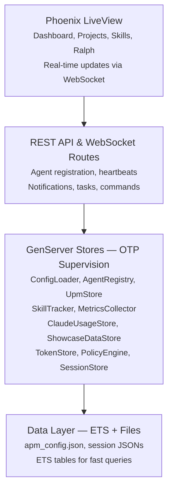

# CCEM APM Documentation

**Version 7.0.0** | Phoenix/Elixir Agentic Performance Monitor

A real-time monitoring and orchestration platform for Claude Code AI agent sessions, providing fleet visualization, multi-project tracking, and autonomous workflow management.

---

## What's New in v7.0.0

- **AgentLock Authorization Protocol** -- 3-layer security model (Agent -> Gate -> Execution) with 10 new auth modules under `lib/apm_v5/auth/`
- **19 New Auth Endpoints** -- Full REST API at `/api/v2/auth/*` for token management, policy CRUD, session control, rate limits, context inspection, and redaction preview
- **Authorization Dashboard** -- `AuthorizationLive` at `/authorization` with token status, policy browser, rate limit gauges, and session inspector
- **Routing Dashboard** -- `RoutingLive` at `/routing` with endpoint routing visualization and auth requirement indicators
- **5 New ActionEngine Actions** -- `rotate_tokens`, `audit_permissions`, `enforce_policy_set`, `reset_rate_limits`, `redact_scope` in the authorization category
- **AG-UI Auth Events** -- EventBus CUSTOM event emission for token, policy, rate limit, and context authorization events
- **CCEMHelper Rename** -- macOS companion app renamed from CCEMAgent to CCEMHelper to avoid confusion with AI agents
- **Getting Started Modal Fix** -- Duplicate modal display bug resolved with localStorage persistence

## What's New in v6.4.0

- **Skills UX Overhaul** -- Full `SkillsLive` rewrite with WCAG 2.1 AA compliance: skip links, ARIA landmarks, `aria-live` search announcements
- **Card Grid Layout** -- Health-ring SVG indicator (green/yellow/red by score), tier badge, trigger pills, and slide-in detail drawer with keyboard focus trap
- **Fix Wizard** -- 4-step guided repair flow (`:diagnose → :select → :preview → :done`) via `ActionEngine` for frontmatter, description, and trigger fixes
- **Session Timeline** -- Vertical invocation timeline sorted by `last_seen` descending with methodology badge and relative timestamp
- **AG-UI Health** -- Summary stats row (Connected/Degraded/Broken counts), per-skill health indicators, Repair button for critical skills
- **SkillsHook JS** -- LiveView hook with `/` keyboard shortcut to focus search, focus trap management for drawer, previous-focus restoration on close
- **Search + Filter Bar** -- Debounced text search (300ms), tier dropdown filter, real-time `phx-change`

## What's New in v6.3.0

- **Claude Usage Tracking** -- `ClaudeUsageStore` GenServer with ETS, PubSub, and effort level inference; token and model tracking at user and project scope
- **UsageLive Dashboard** -- `/usage` LiveView with summary bar, model breakdown table, project accordion, and 10-second refresh
- **Usage REST API** -- `UsageController` at `/api/usage/*` (5 endpoints: record, summary, by-project, by-model, clear)
- **PostToolUse/PreToolUse Hooks** -- `claude_usage_record.sh` (fire-and-forget recording) and `claude_usage_check.sh` (intensive usage warning)
- **CCEMHelper Usage Section** -- `UsageModels.swift`, `fetchUsageSummary()`, and `usageSection` in MenuBarView

## What's New in v6.0.0

- **Showcase** -- Project-scoped GIMME-style dashboard with per-project feature roadmaps, architecture diagrams, and live APM data; data isolated per project namespace
- **Port Intelligence** -- Port registry with conflict detection, utilization heatmaps, and smart reassignment via ActionEngine
- **CCEM UI** -- Dual-section sidebar (CCEM Management / APM Monitoring) with dynamic header branding
- **Performance** -- Code-split app.js bundle (D3 lazy-loaded per route), scoped showcase CSS, WebSocket-only LiveView transport
- **AG-UI Protocol** -- Standardized event-based agent-user interaction with SSE streaming, state management, and HookBridge translation
- **Formation System** -- Agent squadrons and swarm orchestration with tier-based classification
- **Documentation Wiki** -- Embedded interactive docs with slash command reference

See the full [Changelog](changelog.md) for version history and release notes.

---

## Quick Start

> **Get running in under 2 minutes:**
>
> 1. Clone the repository: `git clone <repo-url> && cd apm-v5`
> 2. Install dependencies: `mix deps.get`
> 3. Start the server: `mix phx.server`
> 4. Open the dashboard: `http://localhost:3032`
>
> For detailed setup instructions, see [Getting Started](user/getting-started.md).

---

## Documentation

### User Guide (10 pages)

Learn to use the dashboard, manage projects, and monitor agents.

- [Getting Started](user/getting-started.md) -- Installation and first launch
- [Dashboard Guide](user/dashboard.md) -- Using the web interface
- [Multi-Project Setup](user/projects.md) -- Managing multiple projects
- [Agent Fleet](user/agents.md) -- Understanding agent types and statuses
- [Authorization](user/authorization.md) -- AgentLock authorization protocol, policies, and token management
- [Ralph Methodology](user/ralph.md) -- Autonomous workflow execution
- [UPM Integration](user/upm.md) -- Project management tracking
- [Skills Analytics](user/skills.md) -- Skill usage and co-occurrence
- [Claude Usage Tracking](user/usage.md) -- Token and model usage tracking by project and effort level
- [Notifications](user/notifications.md) -- Alert system overview

### Developer (11 pages)

Architecture, API reference, and extending the platform.

- [Architecture](developer/architecture.md) -- System design and GenServers
- [API Reference](developer/api-reference.md) -- Complete endpoint documentation
- [LiveView Pages](developer/liveview-pages.md) -- Frontend components
- [PubSub Events](developer/pubsub-events.md) -- Real-time event system
- [AG-UI Protocol](developer/ag-ui-protocol.md) -- Event types, SSE streaming, and state management
- [Authorization](developer/authorization.md) -- AgentLock auth modules, policy engine, token lifecycle, and rate limiting
- [Showcase](developer/showcase.md) -- Project-scoped dashboard, ShowcaseDataStore, and IP-safe presentation
- [CCEM UI](developer/ccem-ui.md) -- Dual-section sidebar, port management dashboard, and CCEM branding
- [Port Management](developer/ports.md) -- Port registry, conflict detection, utilization heatmaps, and smart reassignment
- [SwiftUI Menubar Helper (CCEMHelper)](developer/swift-agent.md) -- Native macOS menubar companion app
- [Extending CCEM](developer/extending.md) -- Adding new features

### Administration (4 pages)

Configuration, deployment, hooks, and troubleshooting.

- [Configuration](admin/configuration.md) -- apm_config.json setup
- [Deployment](admin/deployment.md) -- Production setup
- [Session Hooks](admin/hooks.md) -- Initialization and registration
- [Troubleshooting](admin/troubleshooting.md) -- Common issues and fixes

### Changelog

- [Version History](changelog.md) -- Release notes and migration guides

---

## Feature Highlights

### Monitoring

- **Real-time Dashboard** -- Agent fleet visualization with D3.js dependency graphs and live WebSocket updates
- **Session Timeline** -- Visual audit logging of agent lifecycle events and state transitions; also available per-skill in SkillsLive Session tab
- **Skills Analytics** -- UEBA-powered skill usage tracking with co-occurrence analysis and methodology detection; WCAG 2.1 AA card grid with Fix Wizard
- **Claude Usage Tracking** -- Token consumption and model usage dashboards at user and project scope, with effort-level inference

### Authorization

- **AgentLock Protocol** -- 3-layer authorization model (Agent -> Gate -> Execution) with policy-based access control
- **Token Management** -- ETS-backed token issuance, validation, revocation, and TTL expiry
- **Rate Limiting** -- Per-agent and per-scope sliding window rate limiting
- **Memory Gate** -- Scope-based memory access control with read/write/execute permissions
- **Redaction Engine** -- Content redaction pipeline with configurable rules and audit logging

### Integration

- **Multi-project Support** -- Project switching with isolated namespaces and subdirectory-scoped sessions
- **UPM Integration** -- Unified Project Management bridging Plane, Linear, and local task tracking
- **SwiftUI Menubar Helper** -- Native macOS CCEMHelper for at-a-glance status via AppKit and URLSession

### Development

- **Ralph Methodology** -- Autonomous fix loops, PRD generation, and progress-driven iteration
- **Agent Fleet Management** -- Tier-based classification with squadron and swarm discovery
- **REST API** -- Full agent registration, heartbeats, commands, and data sync endpoints
- **Interactive Docs** -- Embedded slash command reference with search and filtering
- **Port Intelligence** -- Port registry with conflict detection, utilization heatmaps, and smart reassignment

---

## System Architecture Overview



---

## Technology Stack

| Component | Technology | Version |
|-----------|-----------|---------|
| Backend | Phoenix Framework (Elixir) | Phoenix 1.8 / Elixir 1.17 |
| Frontend | Phoenix LiveView | LiveView 1.1 |
| Styling | daisyUI + Tailwind CSS | daisyUI 4.x / Tailwind 3.x |
| Visualization | D3.js | v7 |
| Menubar Agent | Swift (AppKit, URLSession) | Swift 5.9 |
| Realtime | Phoenix PubSub (WebSocket) | -- |
| Data | JSON config, ETS tables, file-based persistence | -- |
| HTTP Server | Bandit | 1.x |

---

## Default Port

CCEM APM runs on **port 3032** by default. Access the dashboard at:

```text
http://localhost:3032
```

---

## Support

For issues, questions, or feature requests, check [Troubleshooting](admin/troubleshooting.md) or review the relevant documentation section.
