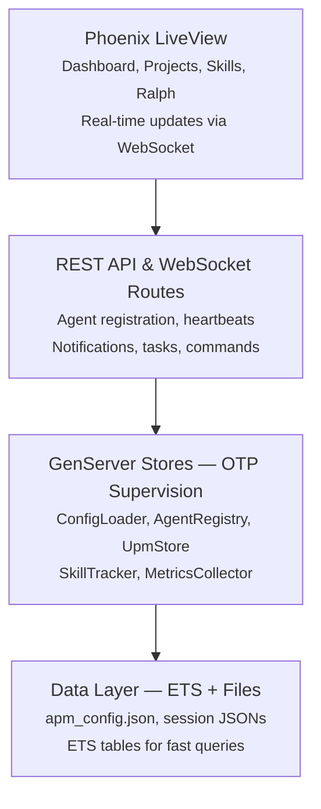

# CCEM APM Documentation

**Version 5.2.0** | Phoenix/Elixir Agentic Performance Monitor

A real-time monitoring and orchestration platform for Claude Code AI agent sessions, providing fleet visualization, multi-project tracking, and autonomous workflow management.

---

## What's New

- **AG-UI Protocol** -- Standardized event-based agent-user interaction with SSE streaming, state management, and HookBridge translation
- **User Acceptance Testing** -- UAT workflow integration with automated verification gates
- **UPM Tracking** -- Unified Project Management integration for cross-tool task sync
- **Formation System** -- Agent squadrons and swarm orchestration with tier-based classification
- **Documentation Wiki** -- Embedded interactive docs with slash command reference
- **Port Management** -- Automatic port 3032 lifecycle with conflict detection

See the full [Changelog](changelog.md) for version history and release notes.

---

## Quick Start

> **Get running in under 2 minutes:**
>
> 1. Clone the repository: `git clone <repo-url> && cd apm-v5`
> 2. Install dependencies: `mix deps.get`
> 3. Start the server: `mix phx.server`
> 4. Open the dashboard: `http://localhost:3032`
>
> For detailed setup instructions, see [Getting Started](user/getting-started.md).

---

## Documentation

### User Guide (8 pages)

Learn to use the dashboard, manage projects, and monitor agents.

- [Getting Started](user/getting-started.md) -- Installation and first launch
- [Dashboard Guide](user/dashboard.md) -- Using the web interface
- [Multi-Project Setup](user/projects.md) -- Managing multiple projects
- [Agent Fleet](user/agents.md) -- Understanding agent types and statuses
- [Ralph Methodology](user/ralph.md) -- Autonomous workflow execution
- [UPM Integration](user/upm.md) -- Project management tracking
- [Skills Analytics](user/skills.md) -- Skill usage and co-occurrence
- [Notifications](user/notifications.md) -- Alert system overview

### Developer (6 pages)

Architecture, API reference, and extending the platform.

- [Architecture](developer/architecture.md) -- System design and GenServers
- [API Reference](developer/api-reference.md) -- Complete endpoint documentation
- [LiveView Pages](developer/liveview-pages.md) -- Frontend components
- [PubSub Events](developer/pubsub-events.md) -- Real-time event system
- [AG-UI Protocol](developer/ag-ui-protocol.md) -- Event types, SSE streaming, and state management
- [Extending CCEM](developer/extending.md) -- Adding new features
- [Testing Guide](developer/testing.md) -- Test patterns and coverage

### Administration (4 pages)

Configuration, deployment, hooks, and troubleshooting.

- [Configuration](admin/configuration.md) -- apm_config.json setup
- [Deployment](admin/deployment.md) -- Production setup
- [Session Hooks](admin/hooks.md) -- Initialization and registration
- [Troubleshooting](admin/troubleshooting.md) -- Common issues and fixes

### Changelog

- [Version History](changelog.md) -- Release notes and migration guides

---

## Feature Highlights

### Monitoring

- **Real-time Dashboard** -- Agent fleet visualization with D3.js dependency graphs and live WebSocket updates
- **Session Timeline** -- Visual audit logging of agent lifecycle events and state transitions
- **Skills Analytics** -- UEBA-powered skill usage tracking with co-occurrence analysis and methodology detection

### Integration

- **Multi-project Support** -- Project switching with isolated namespaces and subdirectory-scoped sessions
- **UPM Integration** -- Unified Project Management bridging Plane, Linear, and local task tracking
- **SwiftUI Menubar Agent** -- Native macOS CCEMAgent for at-a-glance status via AppKit and URLSession

### Development

- **Ralph Methodology** -- Autonomous fix loops, PRD generation, and progress-driven iteration
- **Agent Fleet Management** -- Tier-based classification with squadron and swarm discovery
- **REST API** -- Full agent registration, heartbeats, commands, and data sync endpoints
- **Interactive Docs** -- Embedded slash command reference with search and filtering

---

## System Architecture Overview



---

## Technology Stack

| Component | Technology | Version |
|-----------|-----------|---------|
| Backend | Phoenix Framework (Elixir) | Phoenix 1.8 / Elixir 1.17 |
| Frontend | Phoenix LiveView | LiveView 1.1 |
| Styling | daisyUI + Tailwind CSS | daisyUI 4.x / Tailwind 3.x |
| Visualization | D3.js | v7 |
| Menubar Agent | Swift (AppKit, URLSession) | Swift 5.9 |
| Realtime | Phoenix PubSub (WebSocket) | -- |
| Data | JSON config, ETS tables, file-based persistence | -- |
| HTTP Server | Bandit | 1.x |

---

## Default Port

CCEM APM runs on **port 3032** by default. Access the dashboard at:

```text
http://localhost:3032
```

---

## Support

For issues, questions, or feature requests, check [Troubleshooting](admin/troubleshooting.md) or review the relevant documentation section.
